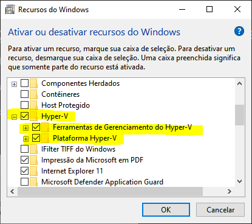

# HYPER-V Criando máquinas virtuais no Windows 10

- Habilitar o recurso do Hyper-V 
- Criar uma máquina virtual padrâo com Debian

### Referências:

- Site oficial - [Link](https://docs.microsoft.com/pt-br/virtualization/hyper-v-on-windows/quick-start/enable-hyper-v)

- Procedimento:

1. Habilitar o recurso do Hyper-V:

- Através da opção de Recursos do Windows



2. Criar uma máquina virtual padrâo pelo gerenciador do Hyper-V:

    a. Criar uma interface de rede externa para acessar os serviços

    b. Configurar a nova máquina com essa interface

    c. Download da ISO do Debian: [https://www.debian.org/CD/http-ftp/] https://www.debian.org/CD/http-ftp/

    d. Criar um par de chaves SSH:

```
ssh-keygen -t rsa
ssh-copy-id usuario@IP
```

3. Instalar o apache na máquina clonada:

```sh
apt-get install -y apache
```

